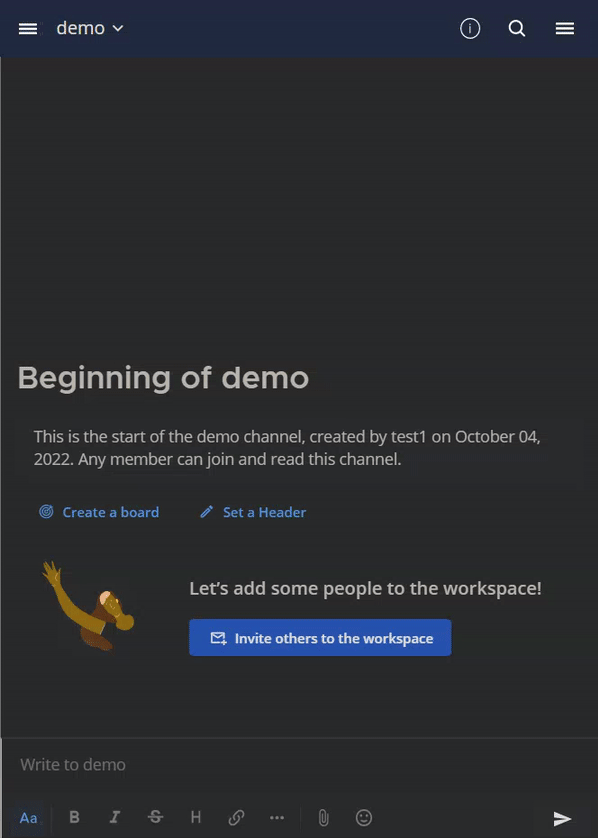

# Mattermost - Anti Revoke
Allows you to see revoked messages on mattermost.

  
Demo

  
  

# What's in the repo?
* [The injected script](./script/antiRevoke.js)
* Another 2 versions of the same script with small modifications to match the platform:
    * [A ViolentMonkey userscript](./userscript/antiRevoke.user.js)
    * [A webpack "compiled" script](./desktop/antiRevoke.js)
* [A powershell script that inserts the script into the electron desktop app](./desktop/inject.ps1)

# Installing the browser version
Insert [antiRevoke.user.js](./userscript/antiRevoke.user.js) into the ViolentMonkey scripts.  
[ViolentMonkey tutorial](https://violentmonkey.github.io/guide/creating-a-userscript/)

# Installing the desktop version
> **Note**  
> Tested on v5.1.1  

Run [inject.ps1](./desktop/inject.ps1)

# Notes
* This is not stable! use with caution.
